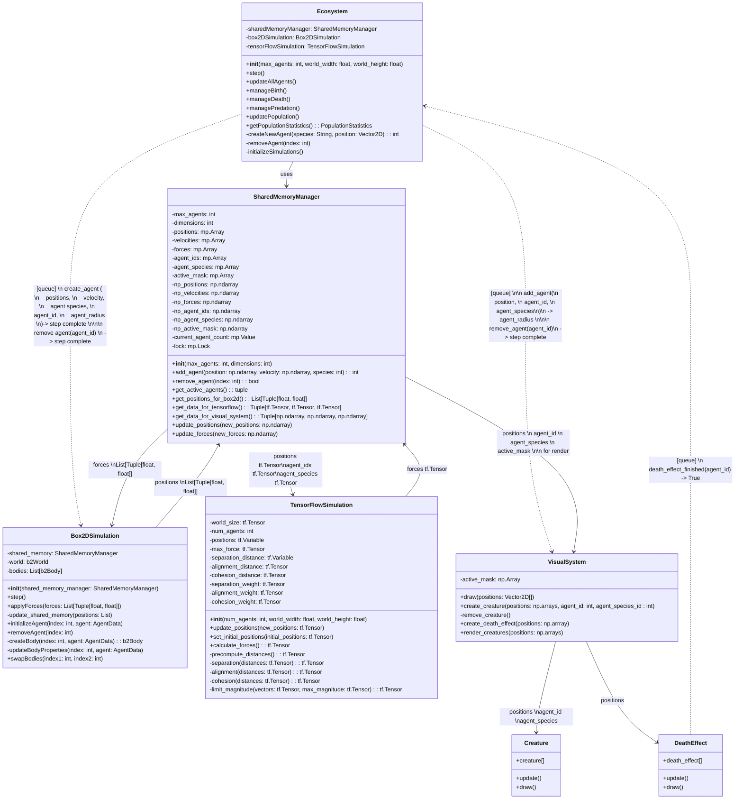
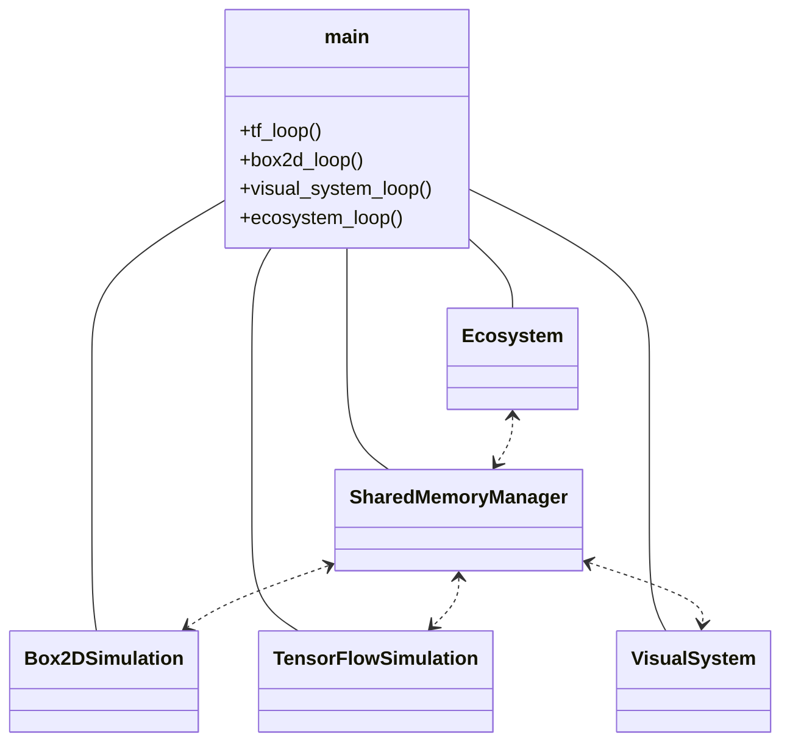

```mermaid
classDiagram

    class Ecosystem {
        -sharedMemoryManager: SharedMemoryManager
        -box2DSimulation: Box2DSimulation
        -tensorFlowSimulation: TensorFlowSimulation
        +__init__(max_agents: int, world_width: float, world_height: float)
        +step()
        +updateAllAgents()
        +manageBirth()
        +manageDeath()
        +managePredation()
        +updatePopulation()
        +getPopulationStatistics() : PopulationStatistics
        -createNewAgent(species: String, position: Vector2D) : int
        -removeAgent(index: int)
        -initializeSimulations()
    }

    class SharedMemoryManager {
        -max_agents: int
        -dimensions: int
        -positions: mp.Array
        -velocities: mp.Array
        -forces: mp.Array
        -agent_ids: mp.Array
        -agent_species: mp.Array
        -active_mask: mp.Array

        -np_positions: np.ndarray
        -np_velocities: np.ndarray
        -np_forces: np.ndarray
        -np_agent_ids: np.ndarray
        -np_agent_species: np.ndarray
        -np_active_mask: np.ndarray
        -current_agent_count: mp.Value
        -lock: mp.Lock

        +__init__(max_agents: int, dimensions: int)
        +add_agent(position: np.ndarray, velocity: np.ndarray, species: int) : int
        +remove_agent(index: int) : bool
        +get_active_agents() : tuple

        +get_positions_for_box2d() : List[Tuple[float, float]]
        +get_data_for_tensorflow() : Tuple[tf.Tensor, tf.Tensor, tf.Tensor]
        +get_data_for_visual_system() : Tuple[np.ndarray, np.ndarray, np.ndarray]

        +update_positions(new_positions: np.ndarray)
        +update_forces(new_forces: np.ndarray)
    }


    class Box2DSimulation {
        -shared_memory: SharedMemoryManager
        -world: b2World
        -bodies: List[b2Body]

        +__init__(shared_memory_manager: SharedMemoryManager)
        +step()
        +applyForces(forces: List[Tuple[float, float]])
        -update_shared_memory(positions: List)
        +initializeAgent(index: int, agent: AgentData)
        +removeAgent(index: int)
        -createBody(index: int, agent: AgentData): b2Body
        -updateBodyProperties(index: int, agent: AgentData)
        +swapBodies(index1: int, index2: int)
    }

    class TensorFlowSimulation {
        -world_size: tf.Tensor
        -num_agents: int
        -positions: tf.Variable
        -max_force: tf.Tensor
        -separation_distance: tf.Variable
        -alignment_distance: tf.Tensor
        -cohesion_distance: tf.Tensor
        -separation_weight: tf.Tensor
        -alignment_weight: tf.Tensor
        -cohesion_weight: tf.Tensor
        +__init__(num_agents: int, world_width: float, world_height: float)
        +update_positions(new_positions: tf.Tensor)
        +set_initial_positions(initial_positions: tf.Tensor)
        +calculate_forces() : tf.Tensor
        -precompute_distances() : tf.Tensor
        -separation(distances: tf.Tensor) : tf.Tensor
        -alignment(distances: tf.Tensor) : tf.Tensor
        -cohesion(distances: tf.Tensor) : tf.Tensor
        -limit_magnitude(vectors: tf.Tensor, max_magnitude: tf.Tensor) : tf.Tensor
    }

    class VisualSystem {
        -active_mask: np.Array
        +draw(positions: Vector2D[] )
        +create_creature(positions: np.arrays, agent_id: int, agent_species_id : int)
        -remove_creature()

        +create_death_effect(positions: np.arrray)
        +render_creatures(positions: np.arrays)
    }

    class Creature {
    +update()
    +draw()
    +creature[]
    
    }

    class DeathEffect {
    +update()
    +draw()
    +death_effect[]
    }

    Ecosystem --> SharedMemoryManager: uses
    Ecosystem ..> VisualSystem: [queue] \n\n add_agent(\n position, \n agent_id, \n agent_species\n)\n -> agent_radius \n\n\n remove_agent(agent_id)\n -> step complete
    Ecosystem ..> Box2DSimulation: [queue] \n create_agent ( \n    positions, \n    velocity, \n    agent species, \n    agent_id, \n    agent_radius \n)-> step complete \n\n\n remove agent(agent_id) \n -> step complete
    DeathEffect ..> Ecosystem: [queue] \n death_effect_finished(agent_id) -> True

    SharedMemoryManager --> TensorFlowSimulation : positions tf.Tensor\nagent_ids tf.Tensor\nagent_species tf.Tensor
    SharedMemoryManager <-- TensorFlowSimulation : forces tf.Tensor
    SharedMemoryManager --> Box2DSimulation : forces \nList[Tuple[float, float]]
    SharedMemoryManager <-- Box2DSimulation : positions \nList[Tuple[float, float]]
    SharedMemoryManager --> VisualSystem: positions \n agent_id \n agent_species \n active_mask \n\n for render


    VisualSystem --> Creature: positions \nagent_id \nagent_species
    VisualSystem --> DeathEffect: positions

```

```mermaid
classDiagram

    class main {
    +tf_loop()
    +box2d_loop()
    +visual_system_loop()
    +ecosystem_loop()
    }

    main -- Ecosystem 
    main -- SharedMemoryManager 
    main -- TensorFlowSimulation
    main -- Box2DSimulation
    main -- VisualSystem
    
    Ecosystem <..> SharedMemoryManager
    SharedMemoryManager <..> Box2DSimulation
    SharedMemoryManager <..> TensorFlowSimulation
    SharedMemoryManager <..> VisualSystem

```