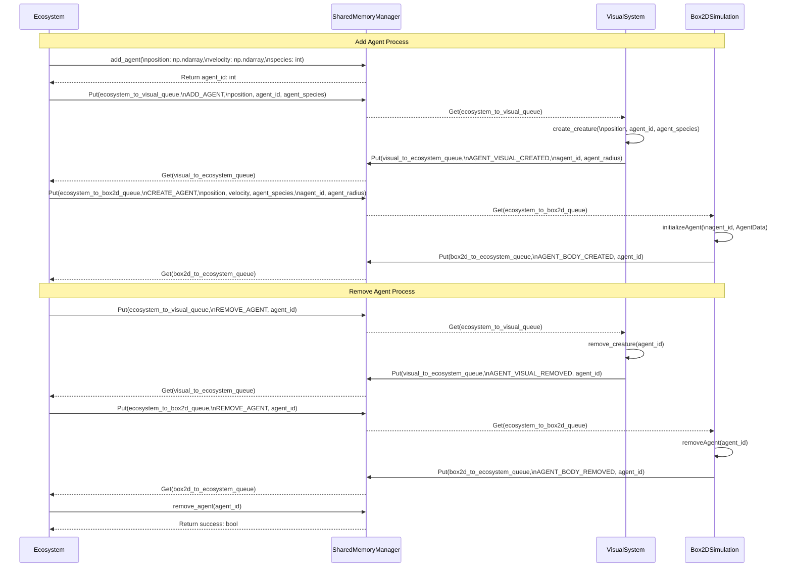

```mermaid
sequenceDiagram
    participant E as Ecosystem
    participant SMM as SharedMemoryManager
    participant VS as VisualSystem
    participant B2D as Box2DSimulation

    Note over E,B2D: Add Agent Process
    E->>SMM: add_agent(\nposition: np.ndarray,\nvelocity: np.ndarray,\nspecies: int)
    SMM-->>E: Return agent_id: int
    E->>SMM: Put(ecosystem_to_visual_queue,\nADD_AGENT,\nposition, agent_id, agent_species)
    SMM-->>VS: Get(ecosystem_to_visual_queue)
    VS->>VS: create_creature(\nposition, agent_id, agent_species)
    VS->>SMM: Put(visual_to_ecosystem_queue,\nAGENT_VISUAL_CREATED,\nagent_id, agent_radius)
    SMM-->>E: Get(visual_to_ecosystem_queue)
    E->>SMM: Put(ecosystem_to_box2d_queue,\nCREATE_AGENT,\nposition, velocity, agent_species,\nagent_id, agent_radius)
    SMM-->>B2D: Get(ecosystem_to_box2d_queue)
    B2D->>B2D: initializeAgent(\nagent_id, AgentData)
    B2D->>SMM: Put(box2d_to_ecosystem_queue,\nAGENT_BODY_CREATED, agent_id)
    SMM-->>E: Get(box2d_to_ecosystem_queue)

    Note over E,B2D: Remove Agent Process
    E->>SMM: Put(ecosystem_to_visual_queue,\nREMOVE_AGENT, agent_id)
    SMM-->>VS: Get(ecosystem_to_visual_queue)
    VS->>VS: remove_creature(agent_id)
    VS->>SMM: Put(visual_to_ecosystem_queue,\nAGENT_VISUAL_REMOVED, agent_id)
    SMM-->>E: Get(visual_to_ecosystem_queue)
    E->>SMM: Put(ecosystem_to_box2d_queue,\nREMOVE_AGENT, agent_id)
    SMM-->>B2D: Get(ecosystem_to_box2d_queue)
    B2D->>B2D: removeAgent(agent_id)
    B2D->>SMM: Put(box2d_to_ecosystem_queue,\nAGENT_BODY_REMOVED, agent_id)
    SMM-->>E: Get(box2d_to_ecosystem_queue)
    E->>SMM: remove_agent(agent_id)
    SMM-->>E: Return success: bool

```