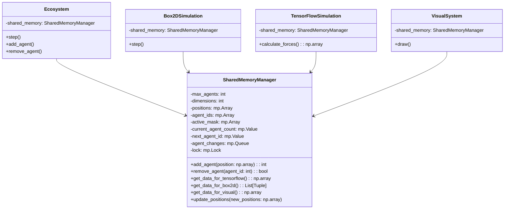

```mermaid
classDiagram
    class SharedMemoryManager {
        -max_agents: int
        -dimensions: int
        -positions: mp.Array
        -agent_ids: mp.Array
        -active_mask: mp.Array
        -current_agent_count: mp.Value
        -next_agent_id: mp.Value
        -agent_changes: mp.Queue
        -lock: mp.Lock
        +add_agent(position: np.array): int
        +remove_agent(agent_id: int): bool
        +get_data_for_tensorflow(): np.array
        +get_data_for_box2d(): List[Tuple]
        +get_data_for_visual(): np.array
        +update_positions(new_positions: np.array)
    }

    class Ecosystem {
        -shared_memory: SharedMemoryManager
        +step()
        +add_agent()
        +remove_agent()
    }

    class Box2DSimulation {
        -shared_memory: SharedMemoryManager
        +step()
    }

    class TensorFlowSimulation {
        -shared_memory: SharedMemoryManager
        +calculate_forces(): np.array
    }

    class VisualSystem {
        -shared_memory: SharedMemoryManager
        +draw()
    }

    Ecosystem --> SharedMemoryManager
    Box2DSimulation --> SharedMemoryManager
    TensorFlowSimulation --> SharedMemoryManager
    VisualSystem --> SharedMemoryManager

```