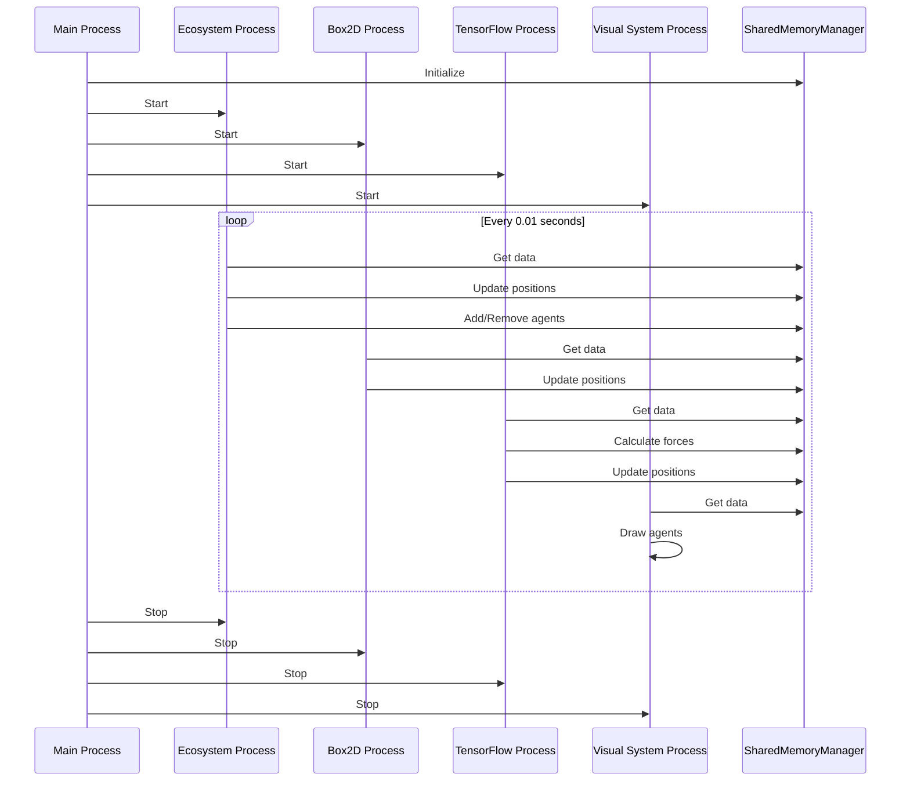

```mermaid
sequenceDiagram
    participant M as Main Process
    participant E as Ecosystem Process
    participant B as Box2D Process
    participant T as TensorFlow Process
    participant V as Visual System Process
    participant S as SharedMemoryManager

    M->>S: Initialize
    M->>E: Start
    M->>B: Start
    M->>T: Start
    M->>V: Start

    loop Every 0.01 seconds
        E->>S: Get data
        E->>S: Update positions
        E->>S: Add/Remove agents

        B->>S: Get data
        B->>S: Update positions

        T->>S: Get data
        T->>S: Calculate forces
        T->>S: Update positions

        V->>S: Get data
        V->>V: Draw agents
    end

    M->>E: Stop
    M->>B: Stop
    M->>T: Stop
    M->>V: Stop

```